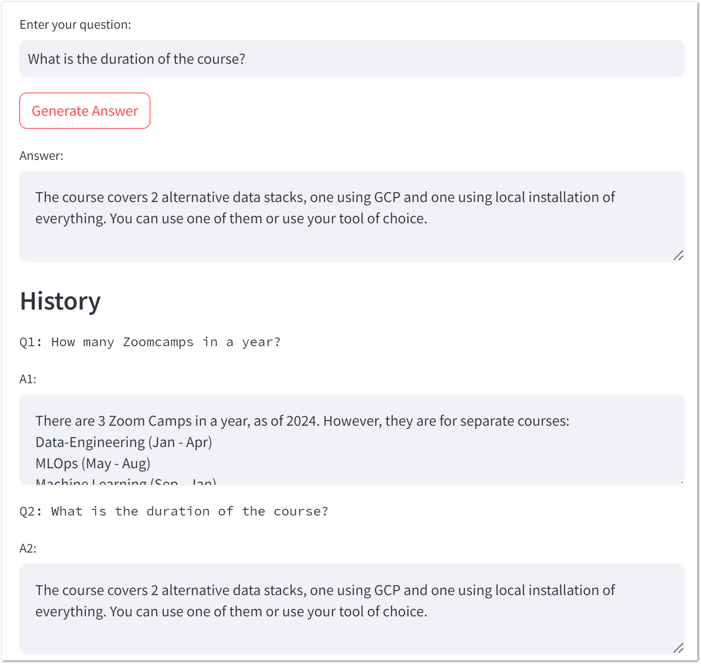

The master class is based on materials from the repository https://github.com/alexeygrigorev/llm-rag-workshop.

The purpose of the workshop is to gain experience in building a RAG system to communicate with your data.
Some changes have been made compared to the original version:
1. OpenAI API replaced with AWS Bedrock text model.
1. Added a user interface based on the "streamlit" library.
1. The project can be started in the VS Code dev container.

## How to run UI
1. Execute the command below in a shell.
    ```bash
    streamlit run ./notebooks/ui.py
    ```
1. Question examples:
- How many Zoomcamps in a year?
- What is the duration of the course?
- What can I do before the course starts?
- What is the price of the course?
- What is the format of the course?
